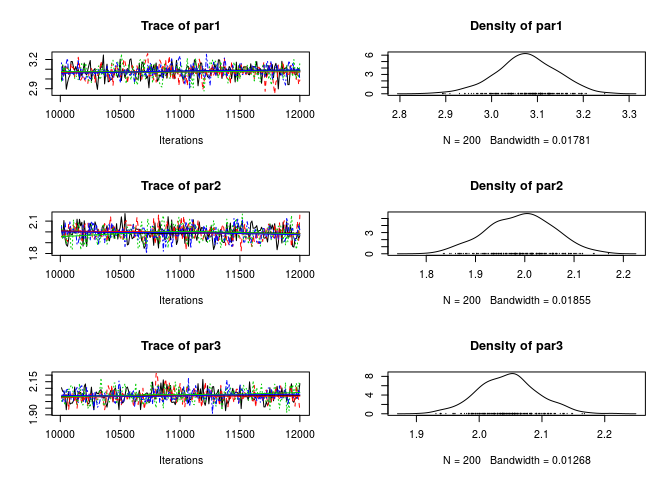

# amcmc: A flexible MCMC estimation framework — a

[](https://travis-ci.org/USCbiostats/amcmc)
[](https://ci.appveyor.com/project/gvegayon/amcmc)
[](https://codecov.io/github/USCbiostats/amcmc?branch=master)
[](https://www.tidyverse.org/lifecycle/#experimental)
[](https://cran.r-project.org/package=amcmc)

Current features:

1.  Automatic stop using convergence checker.

2.  Parallel chains using `parallel`

3.  Flexible framework to specify different transition kernels.

4.  Implements the Normal (random walk) with reflective boundaries
    kernel.

# Installing

From github:

``` r
devtools::install_github("USCbiostats/amcmc")
```

# Example

Linear regression model

``` r
library(amcmc)

# Simulating data
set.seed(78845)
n <- 1000
X <- rnorm(n)
y <- 3 + 2*X + rnorm(n, sd = 2)

# Loglikelihood function
ll <- function(par, X., y.) {
  
  ans <- sum(log(dnorm((y. - (par[1] + X.*par[2]))/par[3])/par[3]))
  
  if (!is.finite(ans))
    return(-Inf)
  
  ans
}
```

``` r
# Running the MCMC
ans <- MCMC(
  ll, X. = X, y. = y,
  initial = c(1, 1, 1),
  # It allows to specify different kernels
  kernel   = kernel_reflective(
    lb    = .00001,
    ub    = 100,
    scale = .1
  ),
  # As well as convergence checkers
  conv_checker = convergence_gelman(threshold = 1.05),
  nsteps   = 2e5,
  thin     = 10,
  autostop = 2e3,
  burnin   = 1e4,
  # As well as parallel chains
  nchains  = 4L,
  multicore = TRUE
  )
```

    ## Warning: While using multiple chains, a single initial point has been
    ## passed via `initial`: c(1, 1, 1). The values will be recycled. Ideally you
    ## would want to start each chain from different locations.

    ## Convergence has been reached with 12000 steps. (200 final count of observations).

``` r
library(coda)

summary(ans)
```

    ## 
    ## Iterations = 10010:12000
    ## Thinning interval = 10 
    ## Number of chains = 4 
    ## Sample size per chain = 200 
    ## 
    ## 1. Empirical mean and standard deviation for each variable,
    ##    plus standard error of the mean:
    ## 
    ##       Mean      SD Naive SE Time-series SE
    ## par1 3.076 0.06644 0.002349       0.002782
    ## par2 1.991 0.06664 0.002356       0.002840
    ## par3 2.046 0.04739 0.001675       0.001813
    ## 
    ## 2. Quantiles for each variable:
    ## 
    ##       2.5%   25%   50%   75% 97.5%
    ## par1 2.939 3.036 3.075 3.122 3.201
    ## par2 1.862 1.943 1.994 2.036 2.117
    ## par3 1.953 2.013 2.046 2.074 2.140

``` r
plot(ans)
```

<!-- -->

``` r
gelman.diag(ans)
```

    ## Potential scale reduction factors:
    ## 
    ##      Point est. Upper C.I.
    ## par1       1.00       1.01
    ## par2       1.00       1.00
    ## par3       1.01       1.02
    ## 
    ## Multivariate psrf
    ## 
    ## 1

# Other tools

  - <https://cran.r-project.org/web/packages/mcmc/mcmc.pdf>

  - <https://cran.r-project.org/web/packages/HybridMC/HybridMC.pdf>

  - <https://cran.r-project.org/web/packages/adaptMCMC/adaptMCMC.pdf>

  - <https://cran.r-project.org/web/packages/elhmc/elhmc.pdf>

# Contributing to `amcmc`

Please note that the ‘amcmc’ project is released with a [Contributor
Code of Conduct](CODE_OF_CONDUCT.md). By contributing to this project,
you agree to abide by its terms.

# Funding

Supported by National Cancer Institute Grant \#1P01CA196596. cd
